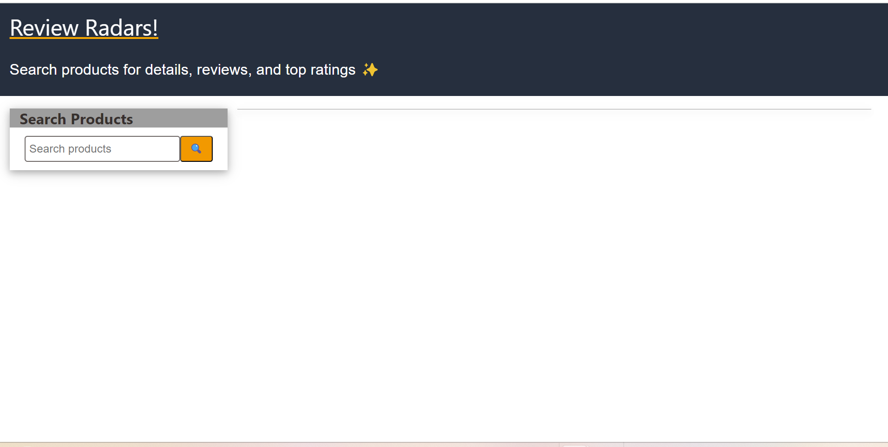
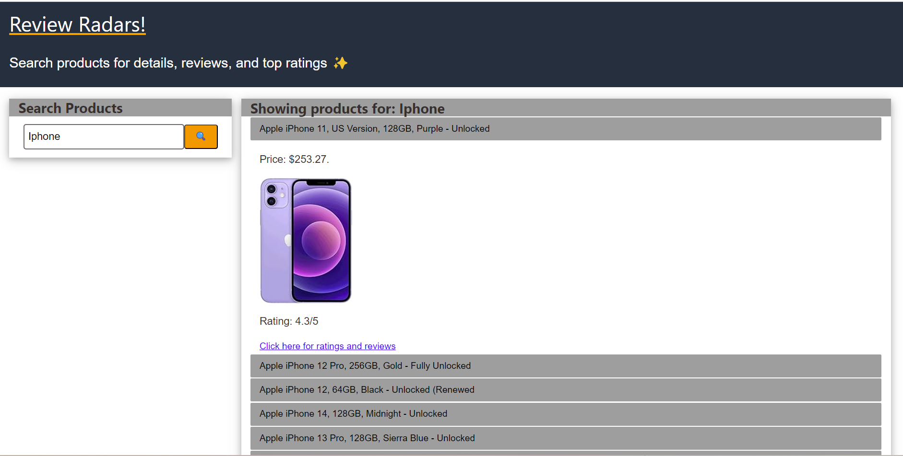
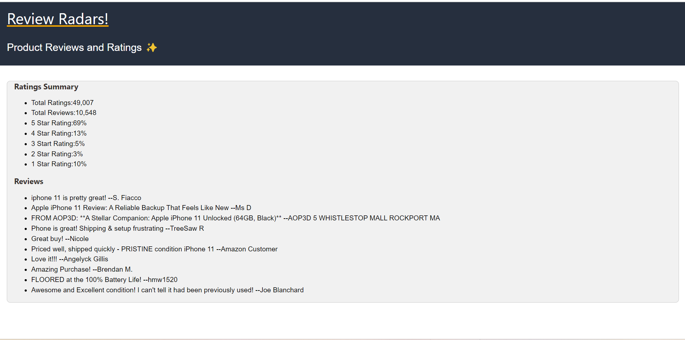

# Review-Radars

## Description

Review-Radars is a data driven application that enables you to search for the products, see products reviews and ratings. The site is similar to other sites, such as Amazon, eBay and so on. 

The landing page of the website consists of a Search bar, where you can search for the products. After products load on the page, each product related information is displayed and link to see the product ratings and reviews.Clicking the link, opens a separate tab displaying the summary of ratings and reviews.

The main motivation of this project, is to built eCommerce site where you can search for the products and get insights about the product ratings and reviews. The summmary view of ratings and reviews adds great value to the customer in making a determination.

The site is built on HTML, W3CSS framework, CSS and JavaScript.Server Side APIs are leveraged to search for the products and retrieve product ratings and reviews based on Product ID. Client side local storage is used to save the Product ID, the user is interested in seeing the product ratings and reviews.

## Screenshots

## Link to Deployed Site

coming soon

